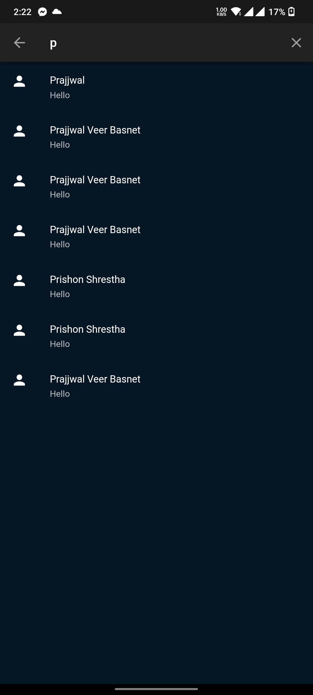

# Bhansa - A Recipe Sharing Platform

  

Bhansa, which simply means "Kitchen" in Nepali, is a recipe sharing platform designed to connect people worldwide enabling them to discover, share, and recreate beloved recipes.
The concept of the application comes from various food that we make in our homes with out own unique touch. It aims to to preserve lost cultures from all around the world so that such recipes can be shared to upcoming generations and to the world.
This way each and every recipe that is here will be different, even if it's the same dish. It adds a touch of personalization from every single creator out there.

  

## Key Features

- Create a new account using your own private email or sign up with google.
- Search for Recipe by categories.
- Add your own recipe, directions to share to the world !
- Save your favourite recipes that are saved to your profile to view at any time.
- Follow your favourite users, chefs to see what new recipes they upload !
- Edit your profile, photo as you'd want to.
- Like reviews in a recipe to let other users know about it.
- You can also find the nearest store available to you to get any missing ingredients ! 

This application was a group project and Final Assignment for 4th Semester utilizing Mobile Application Development using Flutter. The aim of creating and working on such project was to implement various software engineering principles, using Agile Methodology followed by Scrum Framework. Using tools like Jira, KanBan Templates, and <a href= "https://www.figma.com/design/XWcjXGRViuTQ9NHqLN9ua0/Cook-Book?node-id=0-1&t=o2kbmrDJaRdPndCt-1"> Figma </a> to Design as well as collborate remotely. Minute Meetings were held every week and Online Meetings almost every day throughout the production of this application. For more detailed information about the application click <a href= "https://drive.google.com/file/d/1zBdhzgCgLnrc_92W_PtS-Nu9mvgNoeWk/view?usp=sharing"> here </a>

## Minimum Requirements:

The application is a lightweight application that runs on more than 90% of today's android phones (2024). The requirements are as follows:
- **App Size**: 25.1 MB
- **Hardware**: 1 GB RAM to run with android 8.0 Oreo.

Download the app :  <a href= "https://drive.google.com/file/d/1JnRQwM5NFa3BezQM-FIML6pZQ_jE6WUG/view?usp=sharing"> Download </a>

## Application Screenshots: 

  
  
  
  
  
  
  
  
  
  
  
  
  
  
  
  
  

## A project by Prajjwal Veer Basnet, Bikash Chaudhary, Prishon Shrestha and Rohit Shahi
